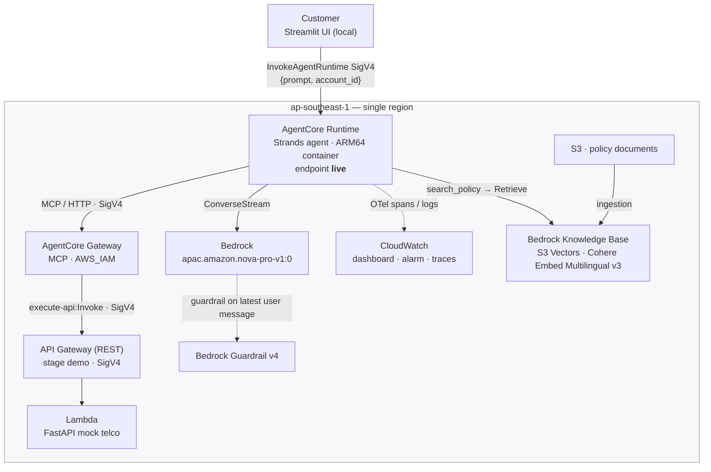

# Project overview

## 1. The business problem

A mobile telco's contact centre spends most of its volume on a small set of
repetitive text-channel questions: *how much is my bill and why*, *what plan am
I on*, *what does roaming cost*, *move me to a different plan*, *waive this fee*.
They arrive by web chat, WhatsApp, social DMs and email. They are cheap
individually and expensive in aggregate, and they crowd out the cases that
genuinely need a person.

**What this agent handles**

- Lists the plans on offer, to anyone, signed in or not.
- Explains a signed-in customer's bill, line by line, from the billing system.
- Reports their current plan and data usage.
- Answers policy questions — roaming rates, excess data, late fees, notice
  periods, early termination — from published policy documents, naming the
  document it used.
- Changes a plan, **after** the customer confirms.
- Raises a ticket to a human team, **after** the customer confirms.

**When it hands over to a human**

- Any fee waiver, refund, billing dispute, complaint, or a direct request for a
  person — these become a ticket with a category, a priority and an SLA.
- A charge the customer believes is on their bill but is not: the agent says so
  and offers a ticket rather than guessing.
- Anything outside telco support, or about another customer's account: declined,
  not escalated.

The design rule is that the agent never *decides* anything irreversible. Both
write tools stop and ask.

## 2. Scope

This is a **proof of concept**, built **solely by me**, against a **mock
backend**. The telco is fictional. The plans, bills, accounts and policy
documents are invented. The "billing system" is one Lambda holding Python dicts
in memory.

Nothing here has served a real customer. Where this document gives numbers, they
are measured from this deployment — eval scores, latency, test results — and
labelled as such. Customer-service benefits are labelled **expected** and are
not claims.

## 3. Architecture



Seven `telco-support-*` CloudFormation stacks plus the `mock-telco-api` SAM
stack, all in one region. The split and the deployment order are in
[OWNERSHIP.md](OWNERSHIP.md).

### One request end to end

Alex (`ACC-1001`) types *"Switch me to Max 1TB"*.

1. The UI sends `InvokeAgentRuntime` with `{"prompt": ..., "account_id": "ACC-1001"}`
   and a stable `runtimeSessionId`. AgentCore gives the session its own microVM.
2. `invoke()` puts `account_id` into `agent.state` — **never** into the prompt, so
   the model cannot be talked out of it.
3. The guardrail checks the message. A prompt attack or a question about another
   customer's account is blocked here, before the model sees it.
4. Nova decides to call `telcoApiGateway___change_plan`, possibly calling
   `get_all_plans` first to resolve the plan ID.
5. Before the call runs, hooks fire: `drop_base_path` removes the Gateway's
   `basePath` input; `bind_account` overwrites `account_id` with the signed-in
   account (logging `ACCOUNT OVERRIDE` if the model asked for a different one)
   and cancels outright for a guest.
6. `HumanInTheLoop` intercepts `change_plan` and raises an interrupt. The agent
   stops. **Nothing has reached the backend.**
7. The runtime stores the interrupt and streams back a question built *by code*,
   not by the model: *"Please confirm: change your plan to MAX_1TB?"*
8. Alex replies "yes" in the same session. The reply is fed back as the interrupt
   response. Only `y`/`yes` approves.
9. The tool now runs: Gateway → API Gateway → Lambda, each hop SigV4-signed.
10. Nova writes the reply, `ThinkingFilter` strips `<thinking>` blocks, chunks
    stream back as SSE.

"no" cancels; `DeclinedToolMessage` replaces the tool result with an unambiguous
statement so the model cannot report success. Proven by
[integration tests](evidence/hitl-tests.md).

## 4. Agent design

**Reasoning loop.** One Strands agent, not a router with specialists. The model
sees all six tools and picks. At six tools with clear descriptions, an
orchestrator would add latency and failure modes for no accuracy gain —
`ToolSelectionAccuracy` is **1.00** across every scored session. Specialist
agents per domain are on the production path, once the tool count justifies it.

**Tools, read versus write.**

| Tool | Read / write | Confirmation |
|---|---|---|
| `get_all_plans`, `get_plan`, `get_bill` | read | no |
| `search_policy` | read (knowledge base) | no |
| `change_plan` | **write** | **yes** |
| `create_ticket` | **write** | **yes** |

Writes are enumerated by exclusion, not inclusion:
`HumanInTheLoop(allowed_tools=["*", "!...change_plan", "!...create_ticket"])`.
A new tool is gated by default and must be explicitly allowed to run freely.

**Grounding.** The system prompt forbids answering from the model's own
knowledge for plans, prices, bills or policies. Policy answers must name their
source document and state only what the retrieved passages say. The measured
effect is `Faithfulness` **1.00**.

The subtle part was teaching it the difference between *a tool failed* and *a
tool succeeded and the thing is not there*. Conflating those produced the worst
defect in the project — see [ANALYSIS.md](../agent/eval/ANALYSIS.md).

**Why Strands + AgentCore Runtime + Gateway.** Strands keeps the agent a plain
Python object with hooks at the points that matter — before a tool call, after a
tool result — which is where account binding and confirmation belong. AgentCore
Runtime gives session isolation (one microVM per session), streaming, and OTel
traces without writing any of it. Gateway turns an existing REST API into MCP
tools without wrapper Lambdas, and keeps the credential boundary outside the
agent: the agent holds no API credentials, the gateway role does.

## 5. Security

**Guardrail** (`platform/20-guardrail.yaml`, version 4):

- `PROMPT_ATTACK` filter at HIGH, input side.
- `HATE`, `INSULTS`, `SEXUAL`, `VIOLENCE`, `MISCONDUCT` at HIGH both directions.
- PII masking for `PHONE` and `EMAIL`, plus regexes for Singapore NRIC/FIN and
  Singapore mobile numbers — **masked on input and output**, so the model never
  receives the raw value.
- A denied topic for other customers' accounts, **input only** (on output it
  blocked legitimate answers about the customer's own bill).

Measured in [evidence/guardrail-tests.md](evidence/guardrail-tests.md).

**Account binding.** The model cannot choose whose account to act on:

```python
def bind_account(self, event: BeforeToolCallEvent) -> None:
    tool = event.tool_use["name"].split("___")[-1]
    if tool not in ACCOUNT_TOOLS:
        return
    account_id = event.agent.state.get("account_id")
    if not account_id:
        event.cancel_tool = "The customer is not signed in. Ask them to sign in..."
        return
    requested = event.tool_use["input"].get("account_id")
    if requested not in (None, "CURRENT", account_id):
        log.warning("ACCOUNT OVERRIDE tool=%s requested=%s used=%s", tool, requested, account_id)
    event.tool_use["input"]["account_id"] = account_id
```

Two layers: the guardrail blocks the *request*, and even if it did not, the hook
overwrites the *parameter* and logs the attempt.

**Human approval for writes:**

```python
interventions=[HumanInTheLoop(allowed_tools=[
    "*",
    "!telcoApiGateway___change_plan",
    "!telcoApiGateway___create_ticket",
])],
hooks=[AccountBinding(), DeclinedToolMessage(), ToolCallLogger()],
```

**SigV4 chain.** UI → Runtime (caller's IAM), Runtime → Gateway
(`bedrock-agentcore:InvokeGateway`), Gateway → API Gateway
(`execute-api:Invoke`, gateway role), API Gateway → Lambda. No bearer tokens or
API keys are stored anywhere in the chain.

**IAM scope.** The runtime role is seven narrow policies, not one blob: model
invoke scoped to `amazon.nova-*` and the APAC inference profile; `ApplyGuardrail`
on one guardrail ARN; `Retrieve` on one in-region knowledge base ARN; `InvokeGateway`;
ECR pull on one repository; logs scoped to
`/aws/bedrock-agentcore/runtimes/*`; `PutMetricData` conditioned on the
`bedrock-agentcore` namespace. The gateway role can do exactly one thing: invoke
one API Gateway stage. Remaining wildcards are the ones AWS does not allow
scoping — X-Ray writes and `ecr:GetAuthorizationToken`.

## 6. Evaluation

**Method.** AgentCore batch evaluation over a committed dataset of 10 scenarios
(`agent/eval/dataset/telco_golden_v1.jsonl`). The runner invokes the deployed
agent once per scenario, waits 180 s for CloudWatch to ingest the spans, submits
`StartBatchEvaluation`, and polls. Reproducible from the repository — it does not
depend on session IDs from a past demo.

Scenarios carry `assertions` (natural language), `expected_trajectory` (tool
names), and a per-scenario `account_id` so signed-in scenarios run as the right
customer.

**Evaluators.** `GoalSuccessRate`, `TrajectoryInOrderMatch`, `Correctness`,
`Faithfulness`, `Helpfulness`, `ToolSelectionAccuracy`, `ToolParameterAccuracy`.

**Results** — copied from [RESULTS.md](../agent/eval/RESULTS.md). Both runs are
the same dataset. See [§8](#how-the-results-were-measured) for the configuration they were
measured on.

| Evaluator | before (v4) | after (v5) |
|---|---|---|
| GoalSuccessRate | 0.88 | **1.00** |
| Correctness | 0.86 | **1.00** |
| Faithfulness | 0.89 | **1.00** |
| Helpfulness | 0.74 | **0.80** |
| TrajectoryInOrderMatch | 1.00 | 1.00 |
| ToolSelectionAccuracy | 1.00 | 1.00 |
| ToolParameterAccuracy | 1.00 | 1.00 |

Sessions scored: **7 of 10**, in both runs.

**Caveats.**

1. Part of that improvement is `q9` leaving the denominator. The fix makes it
   call `create_ticket`, which triggers the interrupt whose span the evaluator
   cannot parse — so it went from *scored and failing* to *not scorable*.
   Excluding q9 from both runs, Correctness moves 0.94 → 1.00 and Faithfulness
   0.96 → 1.00, which is the like-for-like gain.
2. Three sessions never score: `q6` because a scenario that correctly calls *no*
   tools has no `expected_trajectory` for the trajectory evaluator, and `q7`/`q9`
   because of the interrupted-span problem.
3. The two human-in-the-loop scenarios are therefore covered by [integration tests](evidence/hitl-tests.md), not by
   the evaluator. Seven tests, all passing, asserting on backend state read
   directly rather than on what the agent says.

The three defects the evaluation found, and what fixed them, are in
[ANALYSIS.md](../agent/eval/ANALYSIS.md).

## 7. Observability

- **Logs.** `INVOKE session=... signed_in=...`, `TOOL CALL`, `TOOL RESULT` with
  status and duration, and `ACCOUNT OVERRIDE` warnings when the model asks for
  an account that is not the signed-in one.
- **Traces.** OpenTelemetry via `opentelemetry-instrument` in the container
  entrypoint, into CloudWatch and X-Ray. CloudWatch **Transaction Search** is on
  — mandatory, or batch evaluation cannot read spans at all.
- **Dashboard** (`telco-support-agent`), six widgets, with metric names verified
  against live CloudWatch: invocations and sessions;
  end-to-end latency p50/p90/p99; model input and output tokens; tool calls,
  4xx, 5xx and backend time; guardrail checks and interventions; agent errors.
- **Alarm.** Tool error rate above 5% over two 5-minute periods, via metric math
  `IF(invocations > 0, ((systemErrors + userErrors) / invocations) * 100, 0)`,
  to SNS. Tool errors rather than latency because a failing backend is the
  failure that actually silences the agent.

## 8. Design decisions and trade-offs

### Single region

Everything runs in **ap-southeast-1** — agent, gateway, guardrail, mock backend,
observability and the knowledge base. No data leaves Singapore: not customer
data, not the policy documents, not the embeddings.

That choice sets the embedding model. `ap-southeast-1` offers no Amazon
embedding model — of the 40 Bedrock models in the region, the only embeddings
are Cohere — so the knowledge base runs on **Cohere Embed Multilingual v3** at
1024 dimensions. (`cohere.embed-v4:0` is offered in the region but is not a
supported knowledge base embedding model there.)

For a telco this is the safer default. Customer data is regulated, and
"these particular documents are public, so it is fine" is an argument that has
to be re-made every time someone adds a new document type. One region removes
the question entirely, and the cost is an embedding model that is less widely
benchmarked rather than one that is worse.

`EmbeddingModelId` and the deploy script's `KB_REGION` are parameters, so a
deployment can put the knowledge base elsewhere if a different embedding model
is required:

```bash
./platform/deploy-stage1.sh                                    # default
KB_REGION=<region> EMBEDDING_MODEL=<model> ./platform/deploy-stage1.sh
```

### How the results were measured

The scores, latency figures and test results in this document come from a
deployment whose knowledge base ran on `amazon.titan-embed-text-v2:0` in
`us-east-1`, with everything else in `ap-southeast-1`. The default configuration
above — Cohere Embed Multilingual v3, in region — **has not been evaluated**.
Retrieval quality varies between embedding models, so the two knowledge-base
scenarios could score differently on it. Re-running the dataset against the
default is the outstanding work.

Measurement conditions, median of 5 runs against the deployed agent:

| Path | Median | Min | Max |
|---|---|---|---|
| Account question, no knowledge base call | **3733 ms** | 3547 | 4210 |
| Policy question, knowledge base call | **4813 ms** | 4509 | 4893 |

The ~1.1 s gap is the cross-region `Retrieve` in that deployment; a client in
Singapore measured the raw call to `us-east-1` at ~646 ms median, so most of it
is network round trip. A single-region deployment does not pay it, and its
latency has not been measured.

### Other decisions

| Decision | Why | Trade-off accepted |
|---|---|---|
| Single agent, not orchestrator + specialists | Six well-described tools; `ToolSelectionAccuracy` is 1.00 | Will not scale to dozens of tools |
| Gateway + existing REST API, not tool Lambdas | No wrapper code; credentials stay outside the agent | Tool descriptions live in the gateway template, which the agent team must review |
| Guardrail on the latest user message only | Cheap, and the attack surface is what the customer types | Tool results are not screened; a poisoned backend could inject |
| Confirmation question built by code | The model cannot misstate what is about to happen | Rigid wording |
| `numberOfResults` 5 → 8 rather than re-chunking | The corpus is under 8 KB; the failure was cross-document coverage | Will not scale; a larger corpus needs section-aware chunking and metadata filters |
| Container image, not CodeZip | Pinned by digest, reproducible, same artefact everywhere | Needs Docker and an ECR repository |
| Two-team split modelled in one repo | Shows the boundary without two repos to keep in sync | The boundary is documented, not enforced — no CODEOWNERS |

## 9. Known limitations

1. **`account_id` is trusted from the UI payload.** Anyone who can invoke the
   runtime can claim to be any customer. The hook binds every tool call to
   whatever the payload said — it prevents the *model* escalating, not the
   *caller* lying. Production needs a verified JWT.
2. **Module-level state.** The agent object, `agent.state` and the pending
   interrupt are module globals. Safe only because AgentCore runs one microVM
   per session. Run locally as a single process, concurrent sessions would
   collide.
3. **The guardrail only sees the latest user message.**
   `guardrail_latest_message=True`. Tool results and earlier turns are not
   screened.
4. **Single agent.** No orchestrator, no specialists.
5. **No AgentCore Memory.** Nothing persists between sessions.
6. **No AgentCore Policy (Cedar).** Tool authorisation is a Python hook, not a
   policy engine. A guest is blocked by code, and still *sees* every tool.
7. **No VPC mode.** The runtime is `PUBLIC`.
8. **No customer-managed KMS.** AWS-managed keys throughout.
9. **Mock data is in Lambda memory.** Plan changes and tickets vanish when the
   container recycles.
10. **The two human-in-the-loop scenarios cannot be scored by batch evaluation**
    (interrupted-span problem), so they rely on integration tests.
11. **`create_ticket` is verified more weakly than `change_plan`** — the mock API
    has no `GET /tickets`, so the tests assert on the reference the agent reports.
12. **No CI.** The evaluation gate is defined in
    [OWNERSHIP.md](OWNERSHIP.md) but nothing enforces it.

## 10. Path to production — all **planned**, none built

| | What | Why it matters |
|---|---|---|
| 1 | **AgentCore Identity with JWT**, Gateway on `CUSTOM_JWT` | Closes limitation 1 — identity comes from a verified token, not the payload. The first thing I would build. |
| 2 | **AgentCore Policy (Cedar)** | Tool authorisation as policy, evaluated per call, with `tools/list` filtered by principal so a guest never sees `change_plan` |
| 3 | **AgentCore Memory** | Recognise a returning customer; stop re-asking what was said last week |
| 4 | **VPC mode + PrivateLink** | Keep runtime egress on the enterprise network; resource policy so only the UI's VPCE can invoke |
| 5 | **Customer-managed KMS** | On the gateway, memory, knowledge base and logs, for key custody and audit |
| 6 | **CI evaluation gate** | Build image → new runtime version → run the dataset → promote the endpoint only if thresholds hold; roll back by repointing the endpoint |
| 7 | **Specialist agents per domain** | Billing, plans, technical — once the tool count outgrows one prompt |
| 8 | **WhatsApp via AWS End User Messaging, email via SES** | The channels where this volume arrives |
| 9 | **Real backends** | Billing and CRM behind the same gateway; the agent does not change |
| 10 | **Cost per conversation** | Token metrics are already on the dashboard; divide by sessions and alarm on the trend |

## 11. Outcomes

**Measured** on the deployment described in [§8](#how-the-results-were-measured):

- Batch evaluation, 10 scenarios, 7 scored: `GoalSuccessRate`, `Correctness`,
  `Faithfulness`, `TrajectoryInOrderMatch`, `ToolSelectionAccuracy` and
  `ToolParameterAccuracy` all **1.00**; `Helpfulness` **0.80**.
- Improvement from one round of prompt and retrieval fixes: Correctness
  0.86 → 1.00, Faithfulness 0.89 → 1.00, GoalSuccessRate 0.88 → 1.00
  (0.94 → 1.00 and 0.96 → 1.00 excluding the session that stopped being
  scorable).
- **7 of 7** human-in-the-loop integration tests passing against the deployed
  runtime, asserting on backend state.
- Prompt injection and off-topic requests blocked at the guardrail; NRIC, phone
  and email masked on input and output, verified with `ApplyGuardrail`.
- Latency: **3.7 s** median for an account question, **4.8 s** for a policy
  question — see [§8](#how-the-results-were-measured) for what the gap is.
- **12 deployment defects** found — 11 fixed, 1 accepted and documented — logged
  in [ENGINEERING_LOG.md](ENGINEERING_LOG.md).

**Expected, if this were taken to production — not achieved, not measured here:**

- Containment of common billing and plan questions without a human.
- Lower average handle time on the cases that still reach a person, because the
  ticket arrives with the bill already checked and summarised.
- Consistent policy answers, because they are retrieved from published documents
  and cited rather than recalled by an agent.

These are hypotheses; this proof of concept has not tested them.
